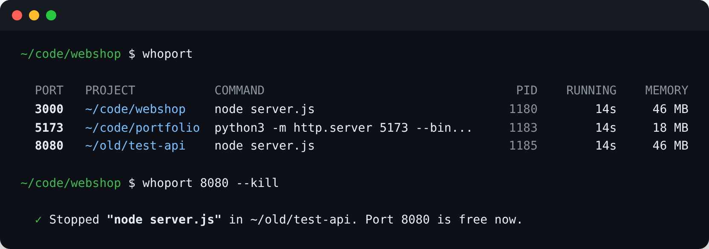

<div align="center">

# whoport

**See which project is running on which port. Then stop it.**

[](https://github.com/vqorn/whoport/actions/workflows/ci.yml)
[](https://github.com/vqorn/whoport/releases/latest)
[](LICENSE)




</div>

```
Error: listen EADDRINUSE: address already in use :::3000
```

You know the drill: `lsof -i :3000`, squint at a PID, `ps`, hunt for the terminal tab you forgot about. `whoport` answers the real question directly: **which project** is that, how long has it been running, and do you want it gone.

- 📁 **Shows the project folder**, not just a PID: it walks up from the process's working directory to the nearest `.git`, `package.json`, `Cargo.toml`, `go.mod` and friends
- ⏱️ **Uptime and memory** for every server, plus a hint when something has been running for days
- 🐳 **Knows your Docker containers**: shows the container name and its Compose project folder instead of `com.docker.backend`
- 🔪 **`whoport 3000 --kill`** stops it politely (SIGTERM), waits, and confirms the port is free. For a container, it stops the container, not Docker
- 🧹 **No noise**: operating system services are hidden (`--all` shows them)
- 🧾 **`--json`** for scripts, and exit codes you can use in `if` statements
- ⚡ A single small C binary. No dependencies, no runtime, starts instantly
- 🐧 Linux, 🍎 macOS and 🪟 Windows

## Install

**Linux and macOS**

```sh
curl -fsSL https://raw.githubusercontent.com/vqorn/whoport/main/install.sh | sh
```

**Windows** (PowerShell)

```powershell
irm https://raw.githubusercontent.com/vqorn/whoport/main/install.ps1 | iex
```

Or grab a binary from [Releases](https://github.com/vqorn/whoport/releases), or build it yourself with any C compiler:

```sh
git clone https://github.com/vqorn/whoport && cd whoport
make && sudo make install
```

## Usage

```sh
whoport                 # every listening port
whoport 3000            # who is on port 3000?
whoport 3000 5173       # several at once (":3000" works too)
whoport 3000 --kill     # stop it
whoport 3000 --kill --force
whoport --all           # include operating system services
whoport --json          # machine-readable
```

```
$ whoport 3000

  Port 3000 is used by node (pid 1142)

  Project   ~/code/webshop
  Command   node src/server.js
  Running   2h 14m since 11:26
  Memory    46 MB
  Address   0.0.0.0 (reachable from your network)

  Stop it: whoport 3000 --kill
```

### Docker

Ports published by Docker usually belong to `docker-proxy` or `com.docker.backend`, which tells you nothing. `whoport` asks the Docker Engine API (over its local socket, no CLI needed) which container is behind each port. For Compose projects it also shows the folder the project lives in:

```
  PORT   PROJECT          COMMAND                              PID    RUNNING    MEMORY
  3000   ~/code/webshop   node server.js                      4121     2h 14m     46 MB
  5433   ~/code/webshop   container webshop-db-1 (postgres:16)
  6379   (docker)         container redis (redis:7)
```

`whoport 5433 --kill` then runs the equivalent of `docker stop webshop-db-1`. Set `WHOPORT_NO_DOCKER=1` to skip the Docker lookup.

### Scripts

`whoport <port>` exits with `0` if the port is in use, `1` if it is free and `2` on errors:

```sh
whoport 5432 >/dev/null || docker compose up -d db
```

## How it works

| | Linux | macOS | Windows |
|---|---|---|---|
| Listening sockets | `/proc/net/tcp`, `/proc/net/tcp6` | `libproc` socket info | `GetExtendedTcpTable` |
| Socket → process | socket inodes in `/proc/<pid>/fd` | file descriptors per process | owning PID in the table |
| Command line | `/proc/<pid>/cmdline` | `KERN_PROCARGS2` | `NtQueryInformationProcess` |
| Project folder | `/proc/<pid>/cwd` | `proc_pidinfo` | the process's PEB |
| Uptime, memory | `/proc/<pid>/{stat,statm}` | `proc_pidinfo` | `GetProcessTimes`, `GetProcessMemoryInfo` |

Processes of other users (databases started by the system, Docker) can only be inspected with `sudo` on Linux and macOS, or from an administrator terminal on Windows. Without it, their ports are still listed.

On Windows, `--kill` ends the process right away: console programs have no equivalent of a polite SIGTERM.

## Development

```sh
make          # build
make test     # unit tests (with AddressSanitizer and UBSan) + an end-to-end test
```

`tests/docker.sh` does the same with a Docker Compose project and checks the container name, the Compose folder and `--kill`.

The end-to-end test starts a real server inside a throwaway project, checks that `whoport` finds it with the right folder, command and JSON, then stops it with `--kill`. CI runs everything on Linux (gcc and clang), macOS and Windows (MinGW via MSYS2).

To build on Windows, install [MSYS2](https://www.msys2.org) with `make` and `mingw-w64-ucrt-x86_64-gcc`, then run `make` in the UCRT64 shell.

```
src/main.c          command line, output, --kill
src/util.c          formatting, project detection, /proc parsing
src/ports_linux.c   Linux backend
src/ports_macos.c   macOS backend
src/ports_windows.c Windows backend
src/docker.c        Docker Engine API client (tiny HTTP + JSON, no dependencies)
src/platform_posix.c  process control on Linux and macOS
```

## License

[MIT](LICENSE)
