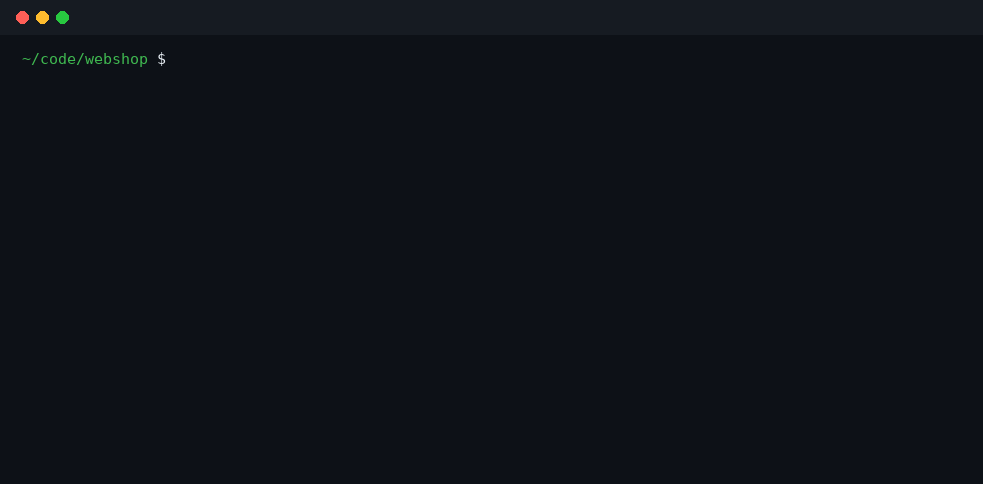

<div align="center">

# whoport

**See which project is running on which port. Then stop it.**

[](https://github.com/vqorn/whoport/actions/workflows/ci.yml)
[](https://github.com/vqorn/whoport/releases/latest)
[](LICENSE)




</div>

```
Error: listen EADDRINUSE: address already in use :::3000
```

You know the drill: `lsof -i :3000`, squint at a PID, `ps`, hunt for the terminal tab you forgot about. `whoport` answers the real question directly: **which project** is that, how long has it been running, and do you want it gone.

- 📁 **Shows the project folder**, not just a PID: it walks up from the process's working directory to the nearest `.git`, `package.json`, `Cargo.toml`, `go.mod` and friends
- 🏷️ **Knows what runs there**: Next.js, Vite, Django, PostgreSQL, Redis and 60 more, from the command line or the Docker image
- ⚠️ **Warns when your database is open to the network**: Docker publishes on `0.0.0.0` by default, so anyone on the same Wi-Fi can reach your Postgres
- ⏱️ **Uptime and memory** for every server, plus a hint when something has been running for days
- 🐳 **Knows your Docker containers**: shows the container name and its Compose project folder instead of `com.docker.backend`
- 🔪 **`whoport 3000 --kill`** stops it politely (SIGTERM), waits, and confirms the port is free. For a container, it stops the container, not Docker
- 🧹 **No noise**: operating system services are hidden (`--all` shows them)
- 📺 **`whoport --live`**: a live view like `htop`, just for ports. Pick a row with the arrow keys, `o` opens it in the browser, `k` stops it
- 🧹 **`whoport stop myapp`** stops everything of a project at once: dev server, API and its Docker containers
- 🌐 **`whoport open 5173`** opens it in your browser
- ⏳ **`whoport --wait 5432`** waits until your database is up: `docker compose up -d && whoport --wait 5432 && npm run dev`
- 👀 **`whoport --watch`** prints a line whenever a port opens or closes
- 🔎 **`whoport --free`** prints the next free port, e.g. `PORT=$(whoport --free 3000) npm run dev`
- 🧾 **`--json`** for scripts, and exit codes you can use in `if` statements
- ⚡ A single small C binary. No dependencies, no runtime, starts instantly
- 🐧 Linux, 🍎 macOS and 🪟 Windows

## Install

**macOS and Linux** with [Homebrew](https://brew.sh)

```sh
brew tap vqorn/whoport https://github.com/vqorn/whoport
brew install whoport
```

**Windows** with [Scoop](https://scoop.sh)

```powershell
scoop bucket add vqorn https://github.com/vqorn/whoport
scoop install whoport
```

**Without a package manager**

```sh
curl -fsSL https://raw.githubusercontent.com/vqorn/whoport/main/install.sh | sh     # Linux, macOS
```
```powershell
irm https://raw.githubusercontent.com/vqorn/whoport/main/install.ps1 | iex          # Windows PowerShell
```

Or grab a binary from [Releases](https://github.com/vqorn/whoport/releases), or build it yourself with any C compiler:

```sh
git clone https://github.com/vqorn/whoport && cd whoport
make && sudo make install
```

## Usage

```sh
whoport                 # every listening port
whoport 3000            # who is on port 3000?
whoport 3000 5173       # several at once (":3000" works too)
whoport 3000 --kill     # stop it (also: whoport stop 3000)
whoport 3000 --kill --force
whoport open 5173       # open http://localhost:5173 in the browser
whoport stop            # stop every server of the project you are in
whoport stop fontia     # ... or of a project by folder name or path
whoport --live          # live view: arrow keys to select, o open, k stop, p stop project, q quit
whoport --watch         # print a line whenever a port opens or closes (or: whoport --watch 3000)
whoport --wait 5432     # wait until something listens on 5432 (--timeout 60 by default)
whoport --free          # first free port from 3000 (or: whoport --free 8080)
whoport --all           # include operating system services
whoport --json          # machine-readable
```

```
$ whoport 3000

  Port 3000 is used by node (pid 1142)

  Project   ~/code/webshop
  Command   node src/server.js
  Running   2h 14m since 11:26
  Memory    46 MB
  Address   0.0.0.0 (reachable from your network)

  Stop it: whoport 3000 --kill
```

### Docker

Ports published by Docker usually belong to `docker-proxy` or `com.docker.backend`, which tells you nothing. `whoport` asks the Docker Engine API (over its local socket, no CLI needed) which container is behind each port. For Compose projects it also shows the folder the project lives in:

```
  PORT   PROJECT          COMMAND                              PID    RUNNING    MEMORY
  3000   ~/code/webshop   node server.js                      4121     2h 14m     46 MB
  5433   ~/code/webshop   docker webshop-db-1                      -     2h 14m         -
  6379   (docker)         docker redis                             -      3d 1h         -
```

`whoport 5433` shows the image as well. `whoport 5433 --kill` then runs the equivalent of `docker stop webshop-db-1`. Works with Docker Engine, Docker Desktop (also on Windows), Colima and OrbStack. Set `WHOPORT_NO_DOCKER=1` to skip the Docker lookup.

### Live view

`whoport --live` keeps the list on screen and updates it every second. New servers light up green for a moment. The selected row's details are shown below the table.

| Key | |
|---|---|
| `↑` `↓` | select a port |
| `o` | open it in the browser |
| `k` | stop it (asks first) |
| `K` | force stop |
| `p` | stop every server of its project |
| `a` | show or hide system services |
| `q` | quit |

### Reachable from the network

A server listening on `0.0.0.0` or `::` accepts connections from every machine that can reach yours: the café Wi-Fi, the office LAN. For a dev server that is sometimes what you want, for a database it almost never is. And Docker publishes ports on `0.0.0.0` unless you say otherwise.

`whoport` marks your own servers and databases that are reachable like that with `⚠` and tells you how to fix it:

```
  Address   0.0.0.0 ⚠ reachable from your network
            Databases should listen on 127.0.0.1 only (Docker: "127.0.0.1:5432:5432").
```

Apps like Spotify or Discord open such ports on purpose, so they are not flagged. `--json` has `"exposed": true` for every port that is reachable from outside.

### Stop a whole project

```
$ whoport stop fontia

  ~/Fontia: 5 servers

    3000   Next.js      docker fontia-frontend-1
    5433   PostgreSQL   docker fontia-postgres-1
    6379   Redis        docker fontia-redis-1
    8000                docker fontia-api-1
    9000   MinIO        docker fontia-minio-1

  Stop all of them? [y/N]
```

A project is the folder a server runs in (walking up to the nearest `.git`, `package.json` and friends) or the folder of its Docker Compose file. `whoport stop` without a name uses the project you are in. `--yes` skips the question, for scripts.

### Watch

```
$ whoport --watch 3000

  Watching port 3000. Ctrl+C to stop.

  14:02:05  3000   ○ free
  14:02:11  3000   ▲ up      node server.js  ~/code/webshop
  14:05:40  3000   ▼ closed  node server.js  ~/code/webshop
```

Without a port it watches every port. In a terminal it also rings the bell, so you notice while you are in another window.

### Scripts

`whoport <port>` exits with `0` if the port is in use, `1` if it is free and `2` on errors. `whoport --wait` exits with `0` once the port is up and `1` after the timeout:

```sh
whoport 5432 >/dev/null || docker compose up -d db
docker compose up -d && whoport --wait 5432 --timeout 30 && npm run dev
PORT=$(whoport --free 3000) npm run dev
```

## How it works

| | Linux | macOS | Windows |
|---|---|---|---|
| Listening sockets | `/proc/net/tcp`, `/proc/net/tcp6` | `libproc` socket info | `GetExtendedTcpTable` |
| Socket → process | socket inodes in `/proc/<pid>/fd` | file descriptors per process | owning PID in the table |
| Command line | `/proc/<pid>/cmdline` | `KERN_PROCARGS2` | `NtQueryInformationProcess` |
| Project folder | `/proc/<pid>/cwd` | `proc_pidinfo` | the process's PEB |
| Uptime, memory | `/proc/<pid>/{stat,statm}` | `proc_pidinfo` | `GetProcessTimes`, `GetProcessMemoryInfo` |

Processes of other users (databases started by the system, Docker) can only be inspected with `sudo` on Linux and macOS, or from an administrator terminal on Windows. Without it, their ports are hidden; `whoport --all` lists them.

On Windows, `--kill` ends the process right away: console programs have no equivalent of a polite SIGTERM.

## Development

```sh
make          # build
make test     # unit tests (with AddressSanitizer and UBSan) + an end-to-end test
```

`tests/docker.sh` does the same with a Docker Compose project and checks the container name, the Compose folder and `--kill`.

The end-to-end test starts a real server inside a throwaway project, checks that `whoport` finds it with the right folder, command and JSON, then stops it with `--kill`. CI runs everything on Linux (gcc and clang), macOS and Windows (MinGW via MSYS2).

To build on Windows, install [MSYS2](https://www.msys2.org) with `make` and `mingw-w64-ucrt-x86_64-gcc`, then run `make` in the UCRT64 shell.

```
src/main.c          command line, output, --kill
src/util.c          formatting, project detection, /proc parsing
src/ports_linux.c   Linux backend
src/ports_macos.c   macOS backend
src/ports_windows.c Windows backend
src/docker.c        Docker Engine API client (tiny HTTP + JSON, no dependencies)
src/platform_posix.c  process control on Linux and macOS
```

## License

[MIT](LICENSE)
